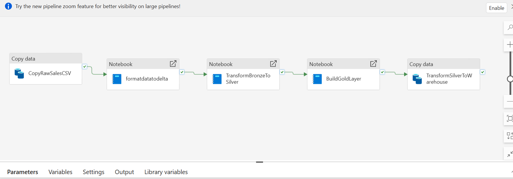
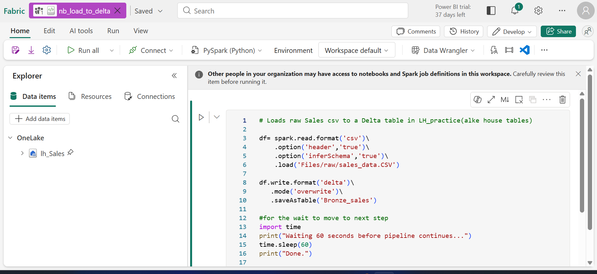
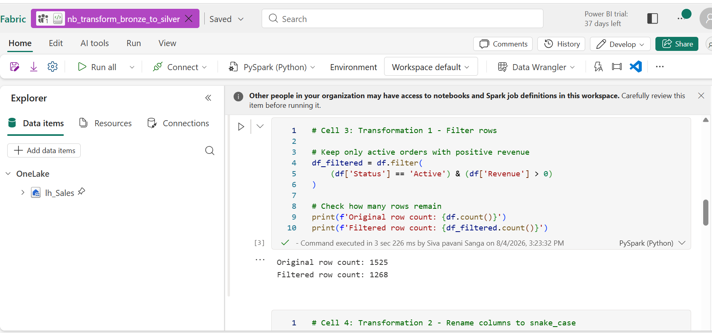
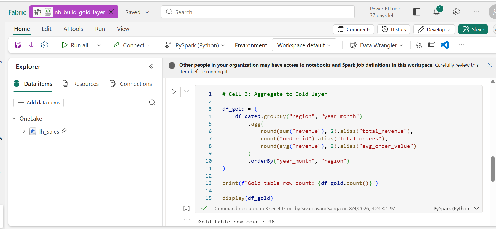
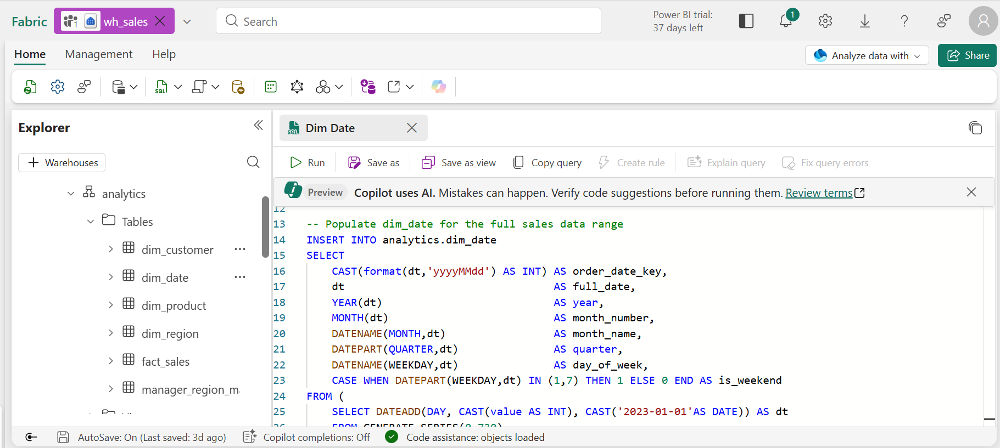
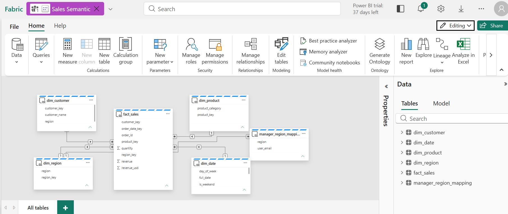
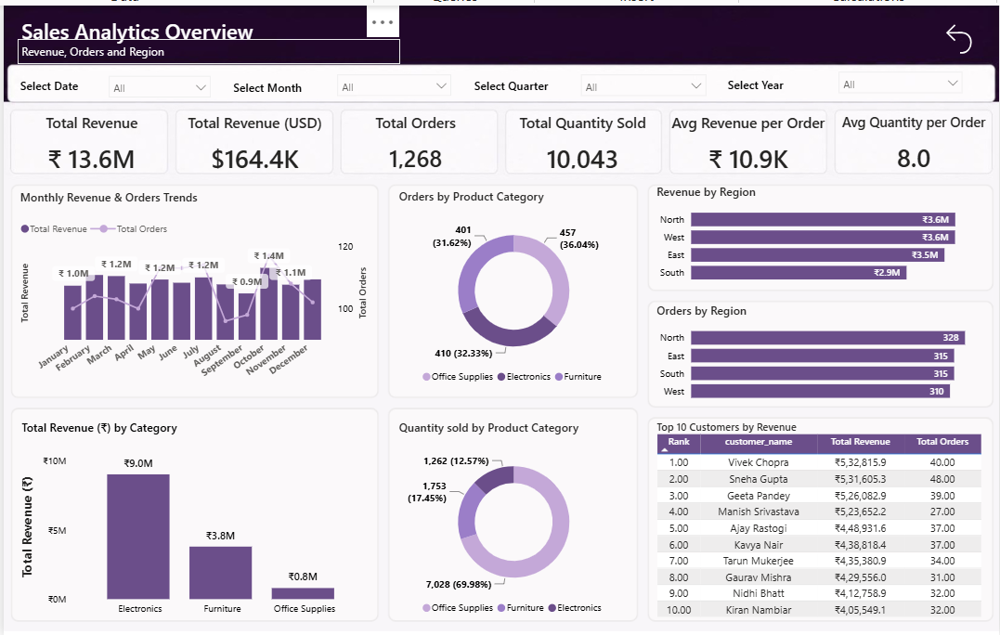

# Walmart Sales Analytics – Microsoft Fabric

## 🚀 Project Overview

An end-to-end **Sales Analytics solution built using Microsoft Fabric and Power BI**, implementing a modern **Medallion Architecture (Bronze → Silver → Gold)**, Fabric Data Warehouse, Star Schema, Direct Lake semantic model, automated data pipelines, and enterprise-style security.

The solution ingests sales data from an external HTTP/CSV source, processes it through multiple data layers, models it for analytics, and delivers an interactive Power BI report.

---

## 🎯 Business Objective

The objective of this project was to build an automated sales analytics platform that enables users to:

- Monitor revenue and order performance
- Analyze sales trends over time
- Compare performance across regions
- Analyze product-category performance
- Identify top customers
- Track order and quantity metrics
- Provide secure, role-based access to regional data

---

# 🏗️ Solution Architecture

The project follows a **Medallion Architecture**:

**External HTTP Source → Fabric Pipeline → Lakehouse → Bronze → Silver → Gold → Fabric Warehouse → Semantic Model → Power BI**


---

# 🔄 Data Ingestion & Pipeline

### External Source

Sales data is provided as a CSV file through an external HTTP/GitHub source.

### Fabric Pipeline

A Fabric Data Pipeline named `pl_ingest_sales` was created to automate ingestion.

The pipeline:

1. Retrieves the raw CSV from the HTTP source
2. Copies the data into the Lakehouse `lh_sales`
3. Stores the raw file under the Lakehouse Files area
4. Executes transformation notebooks
5. Loads processed data into the Warehouse
6. Supports scheduled end-to-end execution



---

# 🥉 Bronze Layer

The raw CSV is converted into a Delta table using a PySpark notebook.

### `bronze_sales`

- Raw and minimally processed data
- Delta table format
- Preserves the initial ingested dataset
- Used as the starting point for downstream transformations



---

# 🥈 Silver Layer

The Bronze data is transformed and standardized using PySpark.

### Transformations performed

- Filtered records where `Status = Active`
- Renamed columns to `snake_case`
- Added calculated USD revenue
- Converted `order_date` from string to Date type
- Standardized the dataset
- Created the `silver_sales` Delta table



---

# 🥇 Gold Layer

The Silver dataset was aggregated to create an analytical Gold layer.

### Aggregation

Data was grouped by:

- Region
- Year-Month

The Gold layer calculates:

- Total Revenue
- Total Orders
- Average Order Value

The resulting `gold_sales_summary` table contains **96 aggregated rows**.



---

# 🏢 Fabric Data Warehouse

A Fabric Warehouse named `wh_sales` was created for analytical consumption.

Three schemas were created:

- `staging`
- `analytics`
- `reporting`

The analytical layer was designed using a **Star Schema**.

### Fact Table

- `fact_sales`

### Dimension Tables

- `dim_date`
- `dim_customer`
- `dim_product`
- `dim_region`

A separate `manager_region_mapping` table was also created to support Dynamic Row-Level Security.



---

# ⭐ Data Modeling

The analytical model follows a Star Schema with:

**Fact Sales → Date, Customer, Product and Region Dimensions**

Relationships were created in the semantic model to support analytical reporting.

Measures were also created for key sales KPIs.



---

# ⚡ Direct Lake & Power BI

A semantic model was created on top of the Fabric Warehouse and used to build the Power BI report.

The report was developed using **Direct Lake mode**, allowing the Power BI model to work directly with the Fabric data platform.

### Key KPIs

- Total Revenue: **₹13.6M**
- Total Revenue (USD): **$164.4K**
- Total Orders: **1,268**
- Total Quantity Sold: **10,043**
- Average Revenue per Order: **₹10.9K**
- Average Quantity per Order: **8.0**

### Report Analysis

The dashboard includes:

- Monthly Revenue & Orders Trends
- Orders by Product Category
- Revenue by Region
- Orders by Region
- Revenue by Category
- Quantity Sold by Category
- Top 10 Customers by Revenue



---

# 🔐 Security & Governance

The solution implements multiple Fabric and Power BI security features.

## Dynamic Row-Level Security (RLS)

A Dynamic RLS role named `Dynamic_region` was created.

The security logic uses:

```DAX
USERPRINCIPALNAME()
